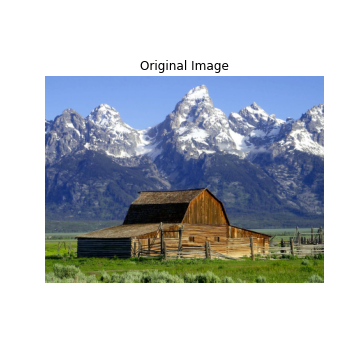
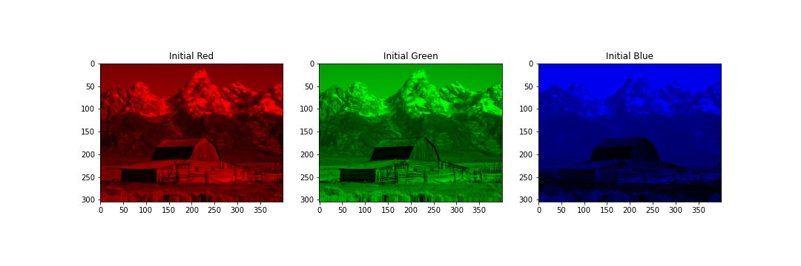
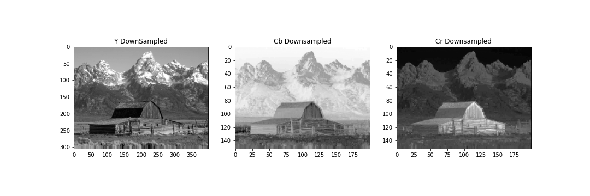
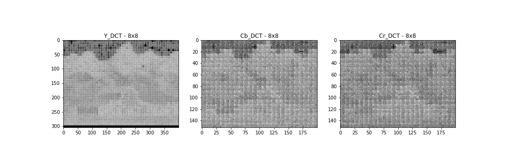

# JPEG Compressor and Decompressor

## Report

__Done by:__

- Marco Pais - Nº 2019218
- Tiago Oliveira - Nº 2019219068
- Emílio Hurtado - Nº 2021169693

### Exercise 1 - Compressão de imagens bmp no formato jpeg utilizando um editor de imagem (e.g., GIMP, Adobe Photoshop, etc.)

- 1.1. Comprima as imagens fornecidas segundo o codec JPEG, com qualidade alta.

- 1.2. Comprima as imagens fornecidas segundo o codec JPEG, com qualidade média.

- 1.3. Comprima as imagens fornecidas segundo o codec JPEG, com qualidade baixa.

- __1.4. Compare os resultados e tire conclusões.__

    > From the obtained files we can say that the bigger the quality is the less the distortion is and te bigger the size of the file is.

### Exercise 2 - Crie duas funções, encoder e decoder, para encapsular as funções a desenvolver nas alíenas 3 a 9

   

### Exercise 3 - Visualização de imagem representada pelo modelo de cor RGB

|__barn\_mountains__|__peppers__|__logo__|
| :---: | :---: | :---: |
||||

- 3.1. Leia uma imagem .bmp, e.g., a imagem peppers.bmp.

- 3.2. Crie uma função para implementar um colormap definido pelo utilizador.

- 3.3. Crie uma função que permita visualizar a imagem com um dado colormap.

- 3.4. Crie uma função para separar a imagem nos seus componentes RGB. Crie também a função inversa.

- __3.5. Visualize a imagem e cada um dos canais RGB (com o colormap adequado).__

|__barn\_mountains__|
| :---: |
||

|__peppers__|
| :---: |
||

|__logo__|
| :---: |
||

### Exercise 4 - Pré-processamento da imagem: padding

- 4.1. Crie uma função para fazer padding da imagem. Caso a dimensão da imagem não seja múltipla de 16x16, faça padding da mesma, replicando a última linha e a última coluna em conformidade. Crie também a função inversa. Certifique-se de que recupera a imagem com a dimensão original, visualizando-a.

|__barn\_mountains__|__peppers__|__logo__|
| :---: | :---: | :---: |
||||

### Exercise 5 - Conversão para o modelo cor YCbCr

- 5.1. Crie uma função para converter a imagem do modelo de cor RGB para o modelo de cor YCbCr. Crie também a função inversa (conversão de YCbCr para RGB). Certifique-se de que consegue obter os valores originais de RGB (teste, por exemplo, com o pixel [0, 0]).
Nota: na conversão inversa, garanta que R, G e B sejam número inteiros no intervalo {0, 1, …, 255}.

- 5.2. Converta a imagem inicial para o modelo de cor YCbCr.

- 5.3. Visualize cada um dos canais (com o colormap adequado).

- __5.4. Compare a imagem de Y com R, G e B e com Cb e Cr. Tire conclusões.__

    > Because there is a lot of redundancy in the RGB model about Luminance all the information about it is stored in the Y channel. In the Cb and Cr channels the information about the crominance is stored. From the obtained images we can conclude that there is a bigger definition in the Y channel than the Cb and Cr channels because the last two don't possess all the information about the color of the image.

|__barn\_mountains__|
| :---: |
||

|__peppers__|
| :---: |
||

|__logo__|
| :---: |
||

### Exercise 6 - Sub-amostragem

- 6.1. Crie uma função para sub-amostrar os canais Y, Cb, e Cr, segundo as possibilidades definidas pelo codec JPEG, a qual deve devolver Y_d, Cb_d e Cr_d. Crie também a função para efectuar a operação inversa, i.e., upsampling. Certifique-se de que consegue reconstruir com exactidão Y, Cb e Cr.

- __6.2. Visualize os canais Y_d, Cb_d e Cr_d com downsampling 4:2:0. Apresente as dimensões das matrizes correspondentes.__

 <strong> barn_mountains </strong> 

|__Downsample__|__Upsample__|
| :---: | :---: |
|||

 

 <strong> peppers </strong> 

|__Downsample__|__Upsample__|
| :---: | :---: |
|||

 

 <strong> logo </strong> 

|__Downsample__|__Upsample__|
| :---: | :---: |
|||

- __6.3. Apresente e analise a taxa de compressão alcançada para as variantes de
downsampling 4:2:2 e 4:2:0 (taxa de compressão, destrutividade, etc.)__

    > The overall compression rate for the 4:2:2 variant is 33.3% since the compression rate on the Y channel is 0% and on the Cb and Cr channels it is 50%.
    The overall compression rate for the 4:2:0 variant is 50% since the compression rate on the Y channel is 0% and on the Cb and Cr channels it is 75%.

## Exercise 7 - Transformada de Coseno Discreta (DCT)

- 7.1. DCT nos canais completos

    - 7.1.1.Crie uma função para calcular a DCT de um canal completo. Utilize a função scipy.fftpack.dct. Crie também a função inversa (usando scipy.fftpack.idct). Certifique-se de que consegue obter os valores originais de Y_d, Cb_d e Cr_d. Nota: para uma matriz, X, com duas dimensões, deverá fazer:
    X_dct = dct(dct(X, norm=”ortho”).T, norm=”ortho”).T

    - 7.1.2.Aplique a função desenvolvida a Y_d, Cb_d, Cr_d e visualize as imagens obtidas (Y_dct, Cb_dct, Cr_dct). Sugestão: atendendo à gama ampla de valores da DCT, visualize as imagens usando uma transformação logarítmica, e.g., de acordo com o seguinte pseudocódigo: imshow(log(abs(X) + 0.0001))

    - __7.1.3. Discuta os resultados obtidos em termos de potencial de compressão.__

        > The compression potencial is lower when there is a big discrepancy of values and bigger when the contrary happens. So the compression potencial is bigger if it is applied in blocks and not on the whole image.

|__barn\_mountains__|
| :---: |
||

|__peppers__|
| :---: |
||

|__logo__|
| :---: |
||

- 7.2. DCT em blocos 8x8

    - 7.2.1.Usando as mesmas funções para cálculo da DCT, crie uma função que calcule a DCT de um canal completo em blocos BSxBS. Crie também a função inversa (IDCT BSxBS). Certifique-se de que consegue obter os valores originais de Y_d, Cb_d e Cr_d.

    - 7.2.2.Aplique a função desenvolvida (DCT) a Y_d, Cb_d, Cr_d com blocos 8x8 e visualize as imagens obtidas (Y_DCT8, Cb_DCT8, Cr_DCT8).

    - __7.2.3. Compare os resultados obtidos com os resultados de 7.1.2 e discuta-os em termos de potencial de compressão.__
    
        > We can see the blocks in the image now and the compression potential is bigger because it is less likely to have descrepant values.

|__barn\_mountains__|
| :---: |
||

|__peppers__|
| :---: |
||

|__logo__|
| :---: |
||

- 7.3. DCT em blocos 64x64.

    - 7.3.1.Repita 7.2

    - __7.3.2. Compare com os resultados anteriores e tire conclusões.__

        > The images obtained have a bigger compression potential than the ones obtained for 7.1 but lower compression potential than the ones obtained for 7.2 because, as the blocks get bigger, the more likely it is for the block to have descrepant values.

|__barn\_mountains__|
| :---: |
||

|__peppers__|
| :---: |
||

|__logo__|
| :---: |
||

## Exercise 8 - Quantização

- 8.1. Crie uma função para quantizar os coeficientes da DCT para cada bloco 8x8. Crie também a função inversa.

- 8.2. Quantize os coeficientes da DCT, usando os seguintes factores de qualidade: 10, 25, 50, 75 e 100. Visualize as imagens obtidas.

 <strong> barn_mountains </strong> 

||||
| :---: | :---: | :---: |

|||
| :---: | :---: |

   

 <strong> peppers </strong> 

||||
| :---: | :---: | :---: |

|||
| :---: | :---: |

   

 <strong> logo </strong> 

||||
| :---: | :---: | :---: |

|||
| :---: | :---: |

- __8.3. Compare os resultados obtidos com os vários factores de qualidade e discuta-os em termos de potencial de compressão.__

    > Variable levels of image compression and quality can be achieved at the quantization step by selecting certain quantization matrices, which is a very valuable aspect of this compression process. This allows the user to choose from a range of quality levels ranging from 1 to 100, with 1 being the worst image quality and maximum compression and 100 representing the best image quality and lowest compression. As a result, the quality/compression ratio can be customized to meet specific requirements.

- __8.4. Compare os resultados obtidos com os resultados da alínea 7 e tire conclusões.__

    > We can see that the image is darker and has less spikes on the high frequencies. This gives the image a bigger compression potential.

## Exercise 9 - Codificação DPCM dos coeficientes DC

- 9.1. Crie uma função para realizar a codificação dos coeficientes DC de cada bloco. Em cada bloco, substitua o valor DC pelo valor da diferença. Crie também a função inversa.

- 9.2. Aplique a sua função aos valores da DCT quantizada.

- __9.3. Analise os resultados e tire conclusões.__

 <strong> barn_mountains </strong> 

||||
| :---: | :---: | :---: |

|||
| :---: | :---: |

   

 <strong> peppers </strong> 

||||
| :---: | :---: | :---: |

|||
| :---: | :---: |

   

 <strong> logo </strong> 

||||
| :---: | :---: | :---: |

|||
| :---: | :---: |

## Exercise 10 - Codificação e descodificação end-to-end

__Nota:__ As funções criadas na alínea 2 deverão conter, neste momento, todo o código de
codificação e descodificação desenvolvido nas alíenas 3 a 9. Note que, após a quantização da DCT, não se pretende, neste trabalho, aplicar os passos de compressão não destrutiva dos coeficientes AC (RLE, Huffman / códigos aritméticos).

- 10.1. Codifique as imagens fornecidas com os seguintes parâmetros de qualidade: 10, 25, 50, 75 e 100

- __10.2. Visualize as imagens descodificadas. Visualize também a imagem das diferenças entre o canal Y de cada uma das imagens originais e da imagem descodificada respectiva para cada um dos factores de qualidade testados. Calcule as várias métricas de distorção (MSE, RMSE, SNR e PSNR) para cada uma das imagens e
factores de qualidade. Tire conclusões.__

    > We can conclude that with the reduction of the quality the images get a lot of distortion. With a lower quality factor we get a reconstructed image thats, by far, different from the original.
    When we compare the reconstructed images with the images that were generated in the first exercise we see that the image with a lower quality is lot similar to the image generated with a quality factor of 75%. We can also see that the quality generated with a quality factor of 100% is very similar to the image of the first exercise that have a median quality. In conclusion, our codec isn't the best, when compared to the JPEG codec.  

 <strong> barn_mountains </strong> 

||||||
| :---: | :---: | :---: | :---: | :---: |

   

 <strong> peppers </strong> 

||||||
| :---: | :---: | :---: | :---: | :---: |

   

 <strong> logo </strong> 

||||||
| :---: | :---: | :---: | :---: | :---: |

 

 <strong> barn_mountains </strong> 

|__/__|__10__|__25__|__50__|__75__|__100__|
| :---: | :---: | :---: | :---: | :---: | :---: |
|__MSE__|__745.103021885521__|__430.200572390572__|__293.2126178451178__|__187.5073316498316__|__55.5368855218855__|
|__RMSE__|__27.2965752775970__|__20.7412770192814__|__17.12345227590271__|__13.69333164901192__|__7.452307395826176__|
|__SNR__|__18.46411256065429__|__20.84956596928497__|__22.51444925412961__|__24.45609327245847__|__29.74046059717426__|
__PSNR__|__19.40864036115411__|__21.794093769784__|__23.4589770546294__|__25.40062107295829__|__30.6849883976740__

 

 <strong> peppers </strong> 

|__/__|__10__|__25__|__50__|__75__|__100__|
| :---: | :---: | :---: | :---: | :---: | :---: |
|__MSE__|__366.5626068115234__|__188.4049733479817__|__133.515401204427__|__104.5550842285156__|__62.2776438395182__|
|__RMSE__|__19.14582478796678__|__13.72606911493533__|__11.55488646436766__|__10.22521805285909__|__7.89161858173076__|
|__SNR__|__19.28447056870463__|__22.1750285448371__|__23.67063852095167__|__24.73250060990748__|__26.9826304374245__|
|__PSNR__|__22.48932200524567__|__25.3798799813781__|__26.87548995749270__|__27.93735204644851__|__30.18748187396557__|

 

 <strong> logo </strong> 

|__/__|__10__|__25__|__50__|__75__|__100__|
| :---: | :---: | :---: | :---: | :---: | :---: |
|__MSE__|__207.816348754448__|__100.9359288256227__|__80.9996725978647__|__60.7447829181494__|__43.066412811387__|
|__RMSE__|__14.4158367344545__|__10.04668745535675__|__8.99998181097410__|__7.79389395091756__|__6.5625004999152__|
|__SNR__|__28.1553215317937__|__31.29166079550465__|__32.2472859990572__|__33.4970287898699__|__34.9907316436679__|
|__PSNR__|__24.95400650685476__|__28.09034577056568__|__29.0459709741182__|__30.29571376493096__|__31.7894166187289__|

- 10.3. Volte a analisar o ponto 1, de forma a validar/complementar as conclusões tiradas nesse ponto.
